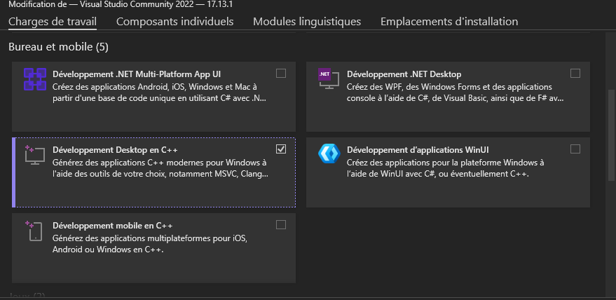
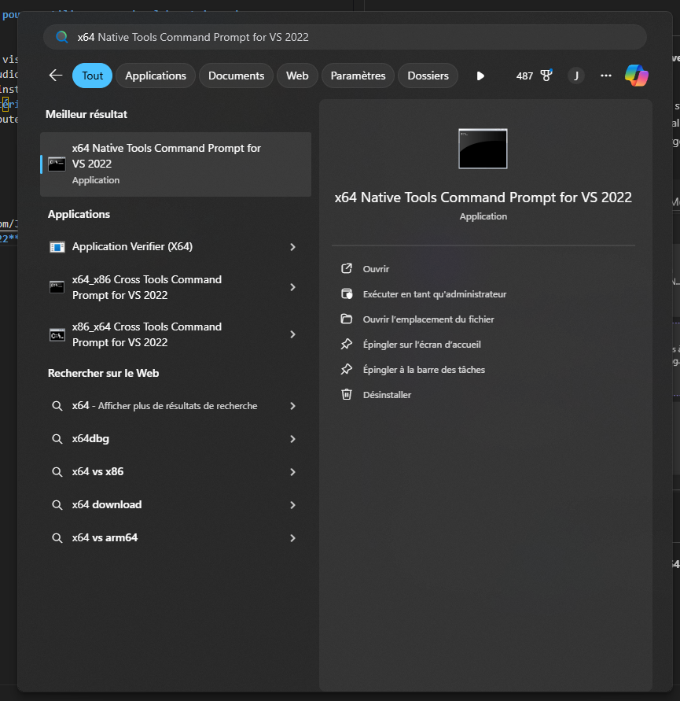
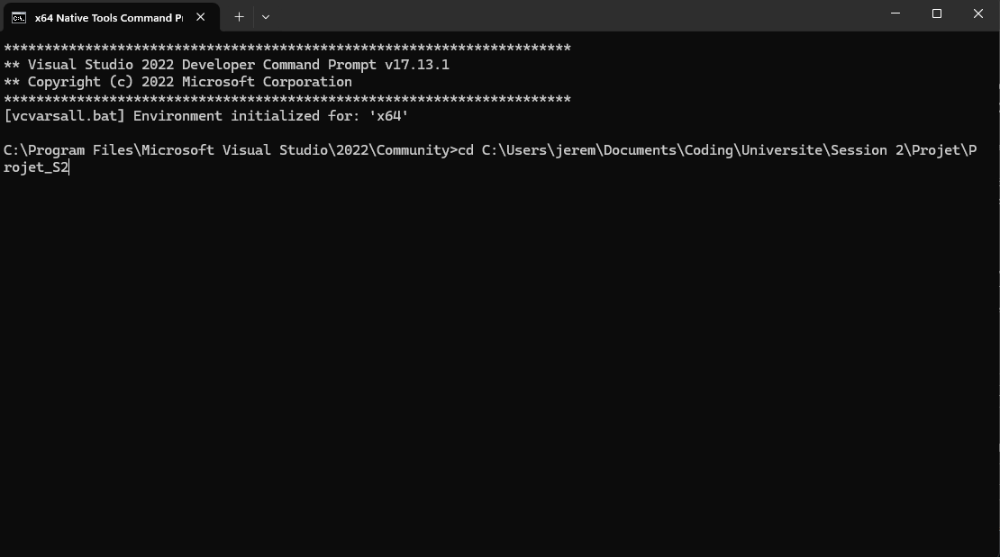
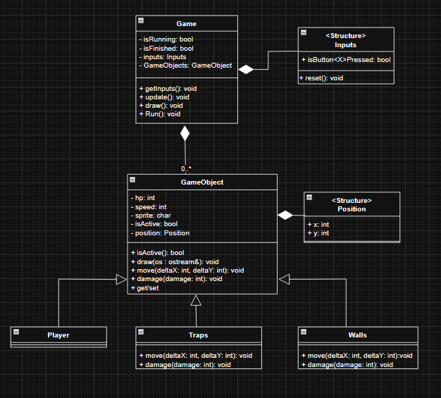

# Projet_S2

## Installation
**Si vous ne voulez pas installer les logiciels vous pouvez utiliser ceux des laboratoires de l'université tout est déjà installé et configuré**

Puisque pour l'APP 7 d'info il faut utiliser Qt avec visual studio 2022 on doit bâtir le projet autour de ces restrictions. Pour installer visual studio 2022 utiliser ce [lien](https://aka.ms/vs/17/release/vs_community.exe). Également, il faut installer Qt simplement suivre la procédure sur le site de session dans la section **Manuels, matériels et logiciels.** Lorsque vous télécharger visual studio 2022 il faut au minimum ajouter le module Développement Desktop en C++.




## Compiler le projet

Clonez le projet depuis le [Github](https://github.com/JDevlooUDS/Projet_S2) puis ouvrez l'outils **X64 Native Tools Command Prompt for VS 2022** depuis le menu windows. 



Naviguez jusqu'à votre répertoire qui contient le projet avec la commande **cd nom_du_projet**.



Puis entrer la commande **qmake config.pro** pour générer les fichiers du projet visual studio. Maintenant, vous pouvez double cliquer sur le fichier .vcxproj pour ouvrir Visual studio avec le projet.

> [!IMPORTANT]
> Lorsque vous voulez ajouter des fichiers vous devez les ajouters dans le fichier config.pro dans la bonne section. Les fichiers .h vont dans **HEADERS** et les fichiers .cpp vont dans **SOURCES** puis il faut refaire la commande **qmake config.pro** pour mettre le projet à jour.

## La structure du projet 
Le projet suis une structure qui ressemble à ceci :
```
Dossier principal
    main.cpp
    header
        fichier d'entête .h
    src
        fichier source .cpp
    image
        image/sprite du jeu ou de la documentation
    config.h
    readme.md
```

## Contribuer au projet
Pour contribuer au projet créer une nouvelle branche à partir de main avec un nom qui correspond à ce sur quoi vous allez travailler. Validez si possible avec au moins 1 personne avant de merge votre branche dans le main

## Structure du code
Il y a deux classe importante la classe **Game**, qui contiendra tout les éléments de logique associé au jeu, et la classe **GameObject** qui vas être la classe de base du jeu. **Presque toutes les classes du jeu vont hériter de GameObject.**

Voici un diagramme de classe qui représente le jeu: 
> [!NOTE]
> À noter qu'il est pour l'instant incomplet et qu'il n'est valide que pour la démo qui sera dans le terminal. Pour la version avec Qt il est fort probable que certaine choses doivent changer pour fonctionner avec Qt.

